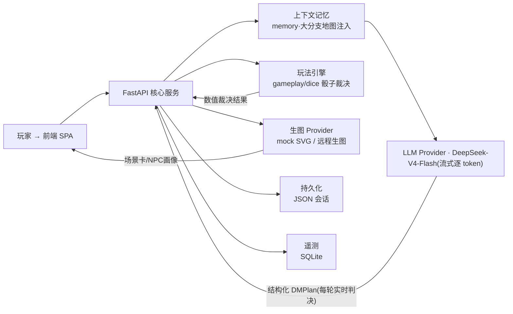
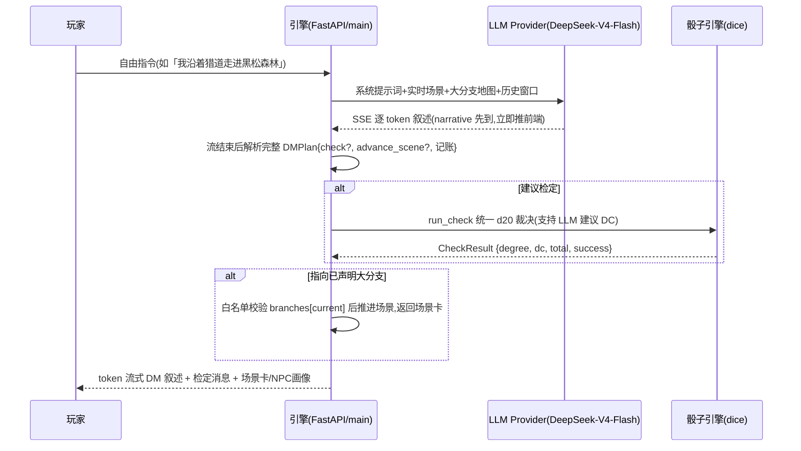

# AI 赛博 DM · 单人 TRPG 智能主持引擎

> 基于 DeepSeek-V4-Flash / 硅基流动等 OpenAI 兼容接口,由 AI 实时扮演跑团主持人(DM):对玩家的**自由指令**当场判决、对随机骰子检定做统一数值裁决、按玩家行动演进**大剧情分支**,并调用生图 API 渲染场景卡与 NPC 画像。
>
> **本仓库不预写任何离线剧情台词/推进链/关键词跳转**——剧本只有「大剧情分支」元数据,剧情走向完全由 DM 每轮实时判决;离线 mock 模式下依然全链路可跑(演示/答辩/CI)。

[](https://www.python.org)
[](https://fastapi.tiangolo.com)
[](LICENSE)

---

## 1. 系统架构总览



- **完整 6 图架构**(用例图 / DFD / 领域类图 / ER 图 / 时序图 / 状态机图):见 `docs/system_design.md`。
- **4 个核心 User Story**(US01–US04,各含 6 图精细化建模 + Gherkin 验收):见 `docs/user_stories/`。
- **4 个 Sprint 迭代报告**:见 `docs/sprint{1..4}_report.md`。

### 实时判决链路(一轮自由行动)



## 2. 特性清单

| 特性 | 说明 | User Story |
|---|---|---|
| 会话生命周期 | 创建/恢复/删除/重启,JSON 持久化 | US01 |
| 自由行动实时判决 | AI DM 逐轮判决 + **SSE 流式逐 token**(首字约 12–16s,整体约 5 倍提速),**无预写剧情** | US02 |
| 骰子与技能检定 | `/roll XdY±Z`、`/check 技能`;DC 支持 LLM 建议 + 引擎统一裁决,SQLite 审计 | US03 |
| 大剧情分支 | 剧情只有「大分支」元数据,`advance_scene` 走白名单校验,防 LLM 幻觉乱跳;**分支树/场景卡实时同步点亮,已走过分支灰显、当前分支金高亮** | US04 |
| 本地存档折叠 | 可保存/载入/导出/导入/删除;**列表默认只展示最近 3 条,其余完全隐藏**,点「展开全部存档」露出 | — |
| 防御性编程 | 输入校验、提示词防护、滑动窗口频控、异常处理、日志脱敏 | 全会话层 |
| 多模态 | 场景卡 / NPC 画像(本地 SVG ↔ 远程生图,自动降级) | US02/03 |
| 评测(EDD) | `eval/evalset.json` + `eval/score.py` 轨迹回放评分 | 质量层 |

## 3. 快速启动

### 方式 A:本地零配置(离线 mock 模式)

无需任何 API Key,启动即可跑完整跑团流程(适合演示/答辩/CI):

```bash
# Windows PowerShell —— 项目根目录
python -m venv .venv
.\.venv\Scripts\python.exe -m pip install -r requirements.txt
.\.venv\Scripts\python.exe -m uvicorn app.main:app --host 0.0.0.0 --port 8000
# 浏览器打开 http://localhost:8000
```

> mock 模式说明:AI DM 不可用时引擎自动降级为「氛围兜底叙述」,保证界面、指令、检定、分支树、生图全链路可演示;接入真实 Key 即切即用。

### 方式 B:接真实 DeepSeek-V4-Flash + 远程生图

复制模板并填写(真实 Key 只写在 `.env`,**严禁入库/提交**):

```bash
Copy-Item .env.example .env
```

`.env` 参考内容:

```ini
# ---- 模型方:mock(离线) | deepseek(DeepSeek/硅基流动 OpenAI 兼容接口) ----
LLM_PROVIDER=deepseek
DEEPSEEK_API_KEY=sk-xxx                          # 你的真实 Key
DEEPSEEK_BASE_URL=https://api.siliconflow.cn/v1   # 硅基流动;官方则 https://api.deepseek.com
DEEPSEEK_MODEL=deepseek-ai/DeepSeek-V4-Flash      # 或 deepseek-chat

# ---- 生图方:mock(本地 SVG) | remote(远程生图 API) ----
IMAGE_PROVIDER=remote
IMAGE_API_KEY=sk-xxx
IMAGE_BASE_URL=https://api.siliconflow.cn/v1
IMAGE_MODEL=Tongyi-MAI/Z-Image-Turbo
IMAGE_SIZE=768x512

# ---- 上下文记忆 ----
MAX_MESSAGES_IN_CONTEXT=30
MAX_CONTEXT_TOKENS=4000

# ---- 防御性编程 ----
RATE_LIMIT_PER_MINUTE=60
MAX_INPUT_LENGTH=500
TELEMETRY_ENABLED=true
```

然后启动:

# python -m uvicorn app.main:app --host 0.0.0.0 --port 8000

> 真实 DM 模式:每次自由指令都会由 DeepSeek-V4-Flash **流式**给出叙述与结构化 `DMPlan`(叙述/是否建议检定/推进到哪个大分支),引擎负责骰子 DC 裁决与大分支白名单推进。

### 方式 C:Docker 一键编排

```bash
docker compose up --build
# 浏览器打开 http://localhost:8000
```

## 4. 玩法与指令

直接打字描述动作即为**自由行动**——由 AI DM 实时判决剧情与检定;斜杠指令同步返回:

| 指令 | 作用 |
|---|---|
| `/roll 1d20+3` | 掷骰并展示投掷摘要 |
| `/check 侦查` | 技能检定(引擎统一 DC 裁决,支持结构化 meta) |
| `/scene` | 查看当前场景卡 |
| `/accept N` / `/complete N` | 接取 / 结算任务 |
| `/attack` | 攻击检定(d20 命中 + 伤害骰,击杀结算经验/掉落) |
| `/hp` / `/inv` / `/spells` / `/sell N` | 生命 / 背包 / 法术位 / 出售物品 |
| `/rest` | 长休(回满 HP 与法术位) |
| `/restart` | 重置会话到开场 |

**剧情推进规则**:剧情只有若干大分支(DM 系统提示词中注入「大分支地图」)。玩家行动明确指向某分支时,AI DM 在 `advance_scene` 给出目标,引擎对 `app/scenario.py` 声明的分支做**白名单校验**后才推进场景——非法/未声明的场景 id 一律拒绝。推进后右侧**剧情分支树实时点亮当前分支(金色)、已走过分支灰显**,场景卡同步切换绘图。

**本地存档折叠**:侧栏「本地存档」默认只展示**最近 3 条**(按更新时间倒序),其余**完全隐藏(连标题也不显示)**;点击底部「展开全部存档 · 共 N 条」才露出全部,再点一次收起。每条存档可单独载入/导出/删除(点击标题展开详情)。

## 5. 质量与评测

```bash
ruff check app tests eval        # 0 error 门禁
ruff format --check app tests eval
python -m pytest tests -q        # 单测 + API 端到端
behave tests/bdd/features        # BDD 验收(Gherkin)
python eval/score.py             # 轨迹评测 → eval/report.json
```

任一门禁失败 → PR 不得合并。

## 6. 目录拓扑

```
.github/workflows/ci.yml          # CI: lint → test → bdd → eval → docker
app/                             # 高内聚、分层解耦主包(mock|deepseek 双 Provider)
static/                          # 前端 SPA(index.html / app.js / style.css)
tests/                           # pytest 单测(tests/unit)+ behave BDD(tests/bdd/features)\neval/                            # evalset.json + score.py
docs/                            # 系统设计 / 用户故事 / Sprint 报告
data/                            # 运行时数据(会话 JSON / 生图缓存 / SQLite 遥测)
.env.example                     # 环境变量模板(严禁真实 Key)
Dockerfile  docker-compose.yml
AGENTS.md  .rules  pyproject.toml  requirements.txt
```

## 7. 分层模块

| 层 | 模块 | 职责 |
|---|---|---|
| presentation | `app/main.py`、`app/rate_limit.py` | REST + SSE 流式(逐 token)、频控中间件、分支树端点 |
| application | `app/gameplay.py`、`app/providers.py` | 指令/检定统一裁决、LLM(流式实时判决)/生图 Provider、大分支白名单推进 |
| domain | `app/models.py`、`app/scenario.py`、`app/dice.py`、`app/memory.py` | Pydantic 契约(DMPlan)、大剧情分支元数据、骰子、实时提示词注入 |
| infrastructure | `app/persistence.py`、`app/storage.py`、`app/config.py` | JSON 持久化、SQLite 遥测、配置 |
| cross-cutting | `app/safety.py` | 输入校验、提示词防护、日志脱敏 |

## 8. 敏捷协作规范

- **看板**:GitHub Projects,每 Sprint 建 Backlog,卡片标注 Story Points,严格 To Do→In Progress→In Review→Done。
- **Commit**:Angular 语义化(`feat: 接入 DeepSeek-V4-Flash 流式输出`、`fix: 修复本地存档折叠样式`、`test: 增加 plan_stream 单测`)。
- **PR 准入**:main 开启分支保护,禁止直接 Push;经 ≥1 名成员 Code Review 且 CI 绿灯后方可合并。
- **规则注入**:`AGENTS.md` 与 `.rules` 声明分层/契约/安全红线。

## 9. License

MIT(见 `LICENSE`)。**严禁将 `.env` 中的真实密钥提交入库**,只保留 `.env.example` 模板。