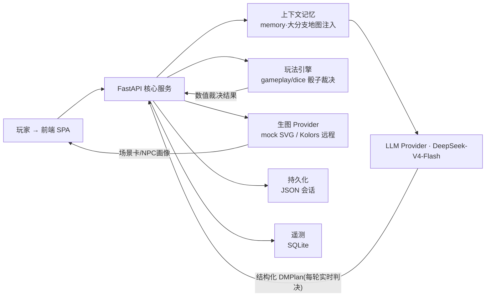
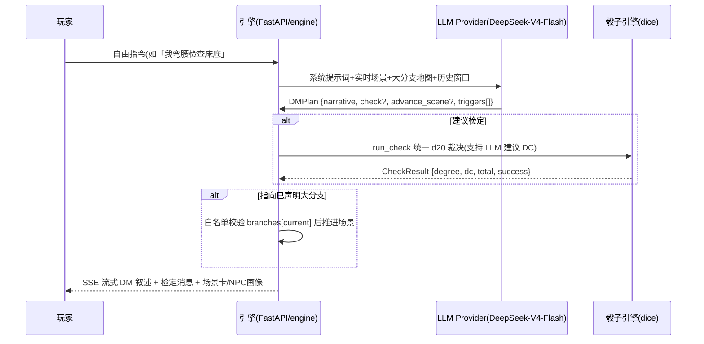

<<<<<<< HEAD
# AI 赛博 DM 与无限跑团/剧本杀引擎 (AI-DM & Immersive RPG Engine)

> 基于 DeepSeek-V4-Flash / 硅基流动等 OpenAI 兼容接口，由 AI 实时扮演跑团主持人(DM):对玩家的**自由指令**当场判决、对随机骰子检定做统一数值裁决、按玩家行动演进**大剧情分支**，并调用生图 API 渲染场景卡与 NPC 画像。
>
> **本仓库不预写任何离线剧情台词/推进链/关键词跳转**——剧本只有「大剧情分支」元数据，剧情走向完全由 DM 每轮实时判决；离线 mock 模式下依然全链路可跑(演示/答辩/CI)。

[](https://github.com/<org>/ai-dm-engine)
[](https://www.python.org)
[](https://fastapi.tiangolo.com)
[](https://docs.pydantic.dev)
[](LICENSE)
[](tests/)

> 发布时把 `<org>` 替换为真实 GitHub 组织账号，并接入 Codecov 后更新覆盖率 badge。

---

## 1. 系统架构总览



- **完整 6 图架构**(用例图 / DFD / 领域类图 / ER 图 / 时序图 / 状态机图):见 `docs/system_design.md`。
- **4 个核心 User Story**(US01–US04,各含 6 图精细化建模 + Gherkin 验收):见 `docs/user_stories/`。
- **4 个 Sprint 迭代报告**:见 `docs/sprint{1..4}_report.md`。

### 实时判决链路(一轮自由行动)



## 2. 特性清单

| 特性 | 说明 | User Story |
|---|---|---|
| 会话生命周期 | 创建/恢复/删除/重启,JSON 持久化 | US01 |
| 自由行动实时判决 | AI DM 逐轮判决 + SSE 流式(token→done),**无预写剧情** | US02 |
| 骰子与技能检定 | `/roll XdY±Z`、`/check 技能`;DC 支持 LLM 建议 + 引擎统一裁决,SQLite 审计 | US03 |
| 大剧情分支 | 剧情只有「大分支」元数据,`advance_scene` 走白名单校验,防 LLM 幻觉乱跳;`/api/scenario/branches` 可视化 | US04 |
| 防御性编程 | 输入校验、提示词防护、滑动窗口频控、异常处理、日志脱敏 | 全会话层 |
| 多模态 | 场景卡 / NPC 画像(本地 SVG ↔ 远程生图,自动降级) | US02/03 |
| 评测(EDD) | `eval/evalset.json` + `eval/score.py` 轨迹回放评分 | 质量层 |

## 3. 快速启动

### 方式 A:本地零配置(离线 mock 模式)

无需任何 API Key,启动即可跑完整跑团流程(适合演示/答辩/CI):

```bash
# Windows PowerShell —— 项目根目录
python -m venv .venv
.\.venv\Scripts\Activate.ps1
pip install -r requirements.txt
python -m uvicorn app.main:app --host 0.0.0.0 --port 8000
# 浏览器打开 http://localhost:8000
```

> mock 模式说明:AI DM 不可用时引擎自动降级为"氛围兜底叙述",保证界面、指令、检定、分支树、生图全链路可演示；接入真实 Key 即切即用。

### 方式 B:接真实 DeepSeek-V4-Flash + 远程生图

```bash
Copy-Item .env.example .env   # 或手动新建 .env
```

编辑 `.env`(严禁把真实 Key 提交到仓库):

```ini
LLM_PROVIDER=deepseek                          # deepseek=OpenAI 兼容接口
DEEPSEEK_API_KEY=sk-xxx                        # 你的真实 Key
DEEPSEEK_BASE_URL=https://api.siliconflow.cn/v1   # 硅基流动示例
DEEPSEEK_MODEL=deepseek-ai/DeepSeek-V4-Flash      # 或官方 deepseek-chat

IMAGE_PROVIDER=remote                          # remote=远程生图 API
IMAGE_API_KEY=sk-xxx
IMAGE_BASE_URL=https://api.siliconflow.cn/v1
IMAGE_MODEL=Kwai-Kolors/Kolors

LLM_TEMPERATURE=0.8
LLM_MAX_TOKENS=600
TELEMETRY_ENABLED=true
```

然后启动:

```bash
python -m uvicorn app.main:app --host 0.0.0.0 --port 8000
```

> 真实 DM 模式:每次自由指令都会由 DeepSeek-V4-Flash 实时给出结构化 `DMPlan`(叙述 / 是否建议检定 / 推进到哪个大分支),引擎负责骰子 DC 裁决与大分支白名单推进。

### 方式 C:Docker 一键编排

```bash
docker compose up --build
# 浏览器打开 http://localhost:8000
```

## 4. 玩法与指令

直接打字描述动作即为**自由行动**——由 AI DM 实时判决剧情与检定;斜杠指令同步返回:

| 指令 | 作用 |
|---|---|
| `/roll 1d20+3` | 掷骰并展示投掷摘要 |
| `/check 侦查` | 技能检定(引擎统一 DC 裁决,支持结构化 meta) |
| `/scene` | 查看当前场景卡 |
| `/hp` | 查看调查员状态 |
| `/help` | 查看指令说明 |
| `/restart` | 重置会话到开场 |

**剧情推进规则**:剧情只有若干大分支(DM 系统提示词中注入「大分支地图」)。玩家行动明确指向某分支时,AI DM 在 `advance_scene` 给出目标,引擎对 `app/scenario.py` 声明的分支做白名单校验后才推进场景——非法/未声明的场景 id 一律拒绝。

## 5. 质量与评测

```bash
ruff check app tests eval        # 0 error 门禁
ruff format --check app tests eval
python -m pytest tests -q        # 单测 + API 端到端
behave tests/bdd/features        # BDD 验收(Gherkin)
python eval/score.py             # 轨迹评测 → eval/report.json
```

## 6. 目录拓扑(与实验要求对齐)

```
.github/
  workflows/ci.yml              # CI: lint → test → bdd → eval → docker
  ISSUE_TEMPLATE/               # User Story / Bug / Feature 模板
  PULL_REQUEST_TEMPLATE.md
docs/
  system_design.md              # 系统级三大模型 + 6 架构图
  user_stories/US01_xxx.md ...  # 核心用户故事(各 6 图 + Gherkin)
  sprint1_report.md ... s4
app/                            # 高内聚、分层解耦主包(mock|deepseek 双 Provider)
tests/                          # pytest 单测 + behave BDD
eval/                           # evalset.json + score.py
.env.example                    # 环境变量模板(严禁真实 Key)
Dockerfile  docker-compose.yml
AGENTS.md  .rules  pyproject.toml
```

> 说明:本仓库以 `app/` 为 Python 包(可运行实体),`src/` 目录语义由 `app/` 承载,二者等价于"源代码主包"。

## 7. 分层模块

| 层 | 模块 | 职责 |
|---|---|---|
| presentation | `app/main.py`、`app/rate_limit.py` | REST + SSE、频控中间件、分支树端点 |
| application | `app/gameplay.py`、`app/providers.py` | 指令/检定统一裁决、LLM(实时判决)/生图 Provider、大分支白名单推进 |
| domain | `app/models.py`、`app/scenario.py`、`app/dice.py`、`app/memory.py` | Pydantic 契约(DMPlan)、大剧情分支元数据、骰子、实时提示词注入 |
| infrastructure | `app/persistence.py`、`app/storage.py`、`app/config.py` | JSON 持久化、SQLite 遥测、配置 |
| cross-cutting | `app/safety.py` | 输入校验、提示词防护、日志脱敏 |

## 8. 敏捷协作规范

- **看板**:GitHub Projects,每 Sprint 建 Backlog,卡片标注 Story Points,严格 To Do→In Progress→In Review→Done。
- **Commit**:Angular 语义化(`feat: 接入 DeepSeek-V4-Flash API`、`fix: 修复上下文记忆溢出`、`test: 增加 US01 的 BDD 验收测试`)。
- **PR 准入**:main 开启分支保护,禁止直接 Push;经 ≥1 名成员 Code Review 且 CI 绿灯后方可合并。
- **规则注入**:`AGENTS.md` 与 `.rules` 声明分层/契约/安全红线。

## 9. 演示视频与最终答辩

- 演示视频:`docs/demo/`(发布时上传 MP4 并在此替换为视频链接)。
- 答辩要点:①无预写剧情的 AI 实时判决跑团,mock 全程可跑、真实 Key 即切即用;②六大架构图 + 故事级六图;③骰子统一数值裁决 + 大分支白名单推进;④防御性编程与 EDD 评测证据;⑤CI/Docker 工程化闭环。

## 10. 贡献清单(Sprint 1–4)

- **@core-backend**:会话/持久化、骰子与检定统一裁决、SSE 输出。
- **@dm-provider**:LLM/生图 Provider 抽象、结构化 DMPlan 契约、上下文记忆与大分支地图注入。
- **@frontend**:SPA 交互、流式渲染、大分支树面板。
- **@quality**:pytest / behave / eval 评测集、CI 与 Docker、文档模板。
- 全组:系统设计、用户故事六图、四期 Sprint 报告。

## 11. License

MIT(发布时附 `LICENSE` 文件)。禁止将 `.env.example` 之外的真实密钥入库。
=======
# ai-dm
小学期项目
>>>>>>> dea3f412b0c37f526b60cb8a7640513cc8c514d9
