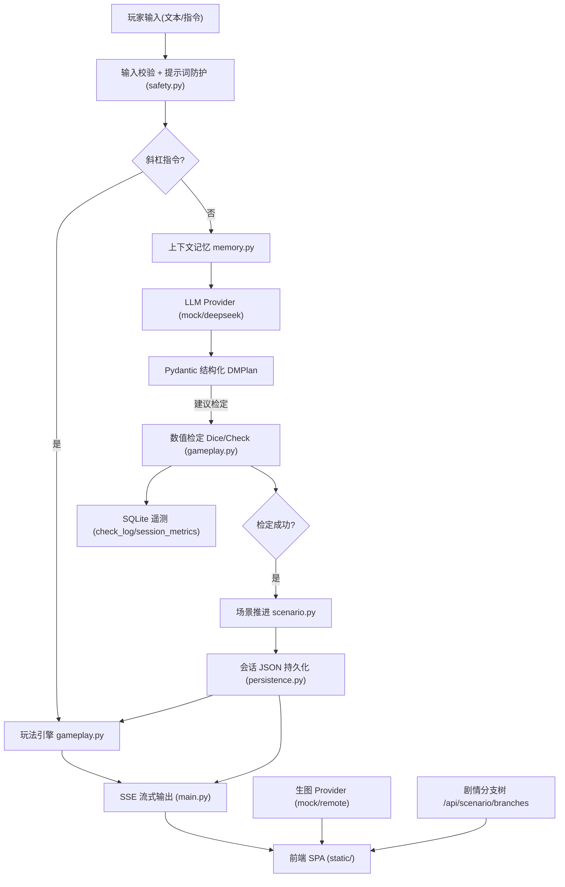
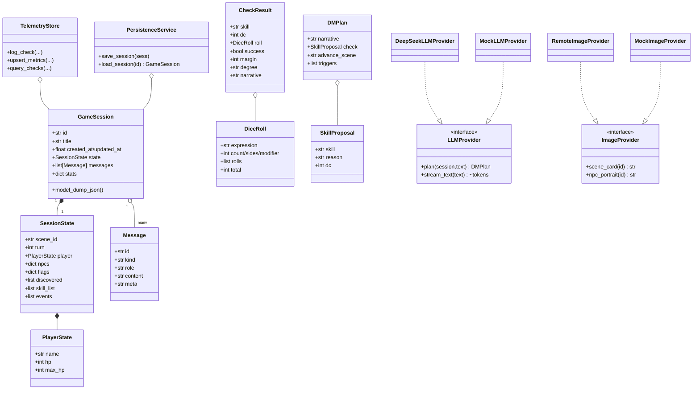
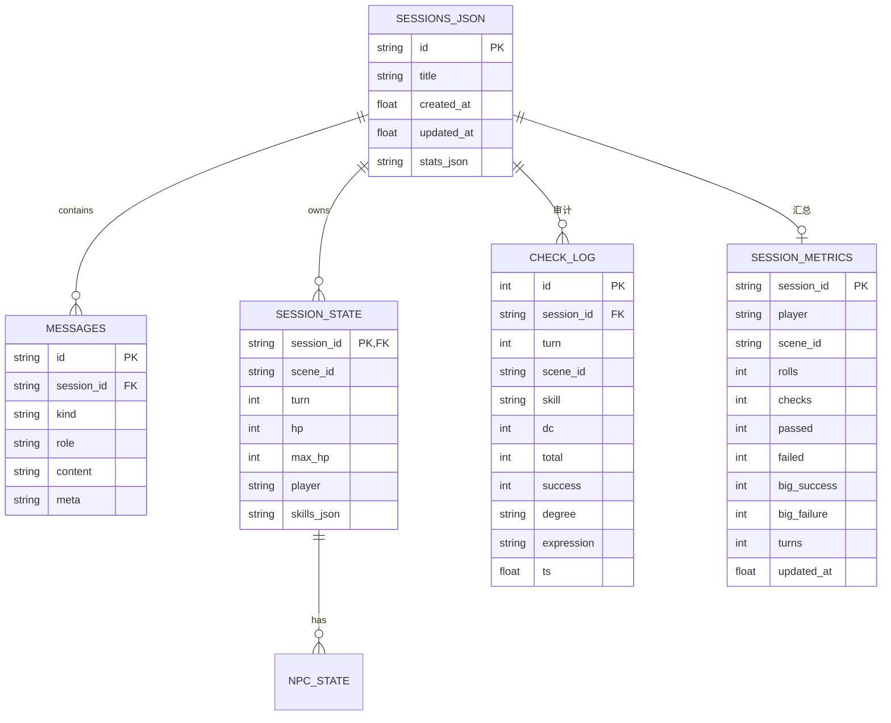
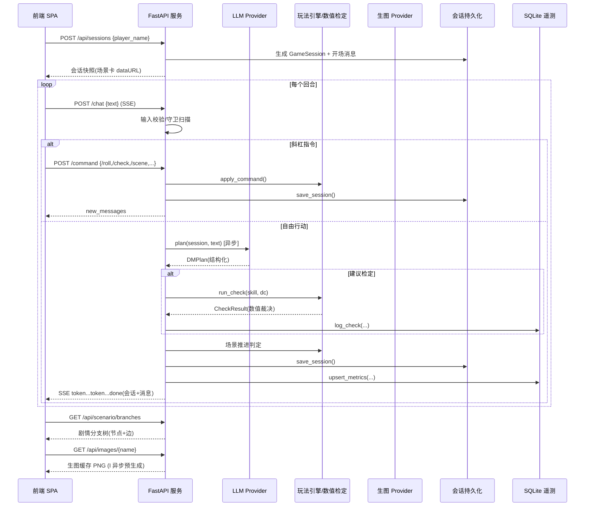
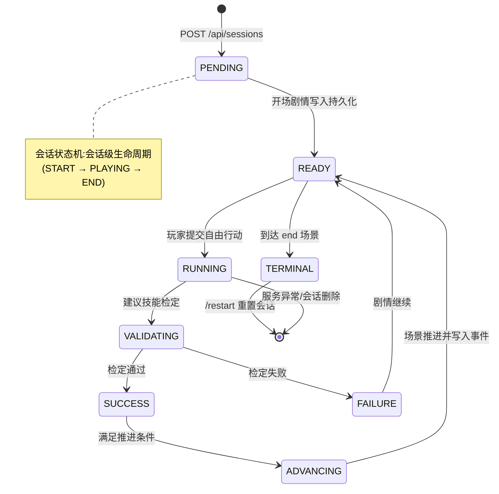
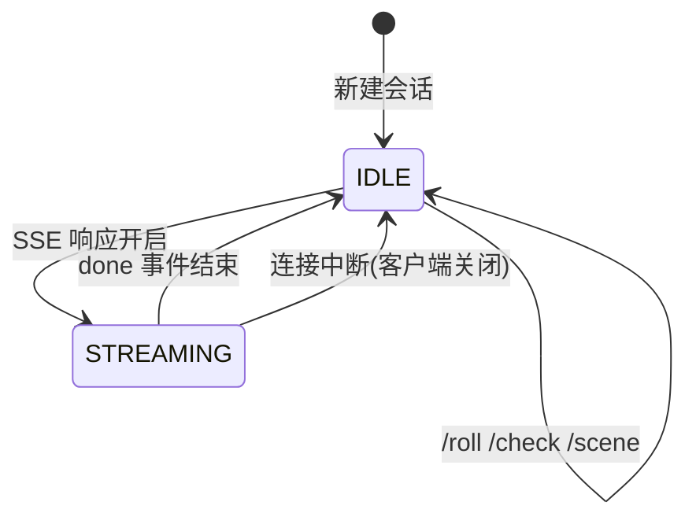

# 系统设计规约 — AI 赛博 DM 与无限跑团/剧本杀引擎

> 版本:v1.0  ·  对应 Sprint 1-4  ·  架构基线:分层解耦 + 三个系统模型(功能/数据/动态)共 6 张核心架构图
> 本文档为团队唯一架构权威(AD),所有模块与 PR 均须与此保持一致。

---

## 0. 架构原则(与 AGENTS.md / .rules 对齐)

1. **严格分层**:`api(表现层) → application(玩法/决策引擎) → domain(领域模型) → infrastructure(存储/外部 Provider)`。禁止跨层直连。
2. **Provider 抽象**:LLM 与生图全部走接口(`BaseLLMProvider` / `BaseImageProvider`),本地 `mock` 保底,接真实 API 只改配置不改代码。
3. **结构化数值契约**:所有骰子检定使用 Pydantic 模型(`DiceRoll` / `CheckResult` / `DMPlan`),模型输出解析失败自动降级 mock(防御性编程)。
4. **防御性编程**:输入校验 → 提示词防护 → 滑动窗口频控 → 全局异常处理 → 日志脱敏。
5. **持久化双轨**:会话正文用 JSON 文档(可版本化、易读),结构化数值审计用 SQLite(`check_log` / `session_metrics`)。
6. **记忆管理**:多轮对话滑动窗口 + token 预算截断(`memory.py`),防止上下文溢出。

---

## 一、功能模型 (Functional Model)

### 1.1 系统顶层用例图 (Use Case Diagram)

```mermaid
flowchart LR
    subgraph SystemBoundary["AI-DM 引擎"]
        UC1["创建/恢复会话"]
        UC2["自由行动(文本输入)"]
        UC3["/roll 掷骰指令"]
        UC4["/check 技能检定"]
        UC5["/scene 场景卡"]
        UC6["/hp 状态查看"]
        UC7["/restart 重置"]
        UC8["SSE 流式 DM 叙述"]
        UC9["结构化数值检定"]
        UC10["场景推进"]
        UC11["剧情分支树可视化"]
        UC12["生图场景卡/NPC画像"]
        UC13["会话持久化/恢复"]
    end

    Player["玩家 (Actor)"]
    Player --> UC1
    Player --> UC2
    Player --> UC3
    Player --> UC4
    Player --> UC5
    Player --> UC6
    Player --> UC7
    UC2 .-> UC8 : <<include>>
    UC4 .-> UC9 : <<include>>
    UC9 .-> UC10 : <<extend>>
    UC2 .-> UC10 : <<extend>>
    UC8 .-> UC11 : <<include>>
    UC8 .-> UC12 : <<include>>
    UC1 .-> UC13 : <<include>>

    LLMAPI["外部 LLM API (DeepSeek/硅基流动)"]
    ImgAPI["外部生图 API (Kolors/FLUX)"]
    Timer["定时触发器 (预先生图预热)"]
    UC8 ---> LLMAPI
    UC12 --> ImgAPI
    Timer --> UC12 : 后台预热
```

### 1.2 系统数据流图 (DFD)



---

## 二、数据模型 (Data Model)

### 2.3 系统领域类图 (Domain Class Diagram)



### 2.4 数据库实体关系图 (ER Diagram / Schema)



> 说明:会话正文为 JSON 文档(SESSIONS_JSON 逻辑实体,按 `data/sessions/{id}.json` 存储);
> `CHECK_LOG` / `SESSION_METRICS` 为 SQLite 物理表(`data/telemetry.db`),由 `storage.TelemetryStore` 维护;
> Pydantic 模型即上述实体的数据契约(`models.py`)。

---

## 三、动态/行为模型 (Dynamic Model)

### 3.5 端到端核心时序图 (System Sequence Diagram)



### 3.6 系统生命周期状态机图 (State Diagram)





---

## 4. 模块清单与目录映射

| 层 | 模块 | 职责 |
|---|---|---|
| presentation | `app/main.py`、`static/` | REST + SSE 路由、前端 SPA、分支树可视化 |
| application | `app/gameplay.py`、`app/providers.py` | 玩法裁决、LLM/生图 Provider、剧情推进 |
| domain | `app/models.py`、`app/scenario.py` | Pydantic 契约、剧本《雾中孤儿院》 |
| infrastructure | `app/persistence.py`、`app/storage.py`、`app/config.py` | JSON 持久化、SQLite 遥测、配置 |
| cross-cutting | `app/safety.py`、`app/rate_limit.py`、`app/memory.py` | 输入校验/守卫、频控、记忆窗口 |
| 质量 | `tests/`、`eval/`、`.github/` | Pytest/Behave、轨迹评测、CI |

## 5. 防御性编程与可靠性设计要点

- LLM 调用失败 → `DeepSeekLLMProvider.plan` 捕获异常并回退 `MockLLMProvider`。
- 生图失败 → `RemoteImageProvider.generate` 返回 False,路由层回退 mock SVG。
- 输入超长/控制字符 → `safety.sanitize_input` 抛 `InputValidationError`,由全局异常处理器转 422。
- 越狱/提示词注入 → `safety.scan_guardrails` 命中后角色内化解,不触发 LLM。
- 频控 → `SlidingWindowRateLimiter` 中间件返回 429。
- 遥测失败(如磁盘只读)→ `except` 吞掉并 warn,不影响主流程。
- 日志脱敏 → `safety.guard_log` 对疑似敏感内容打 `*masked*`。