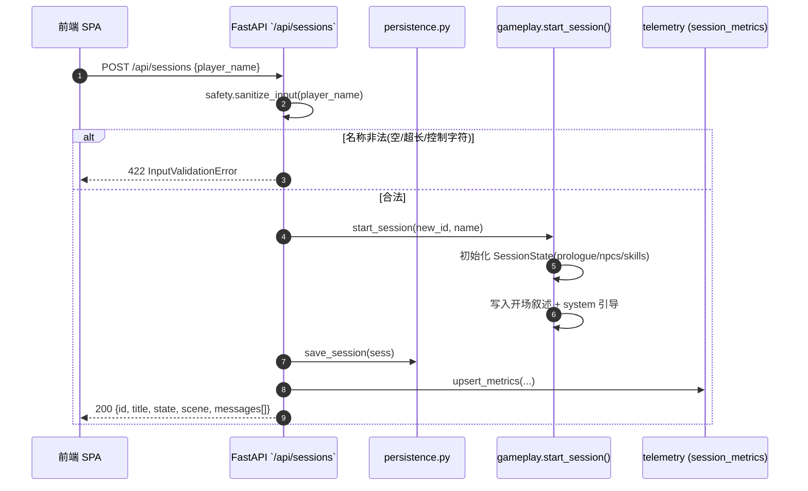
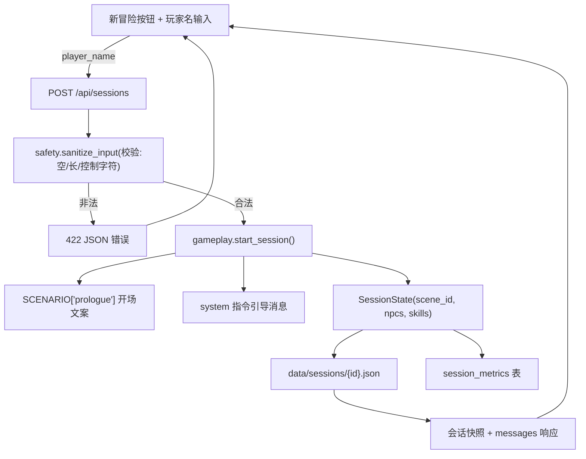
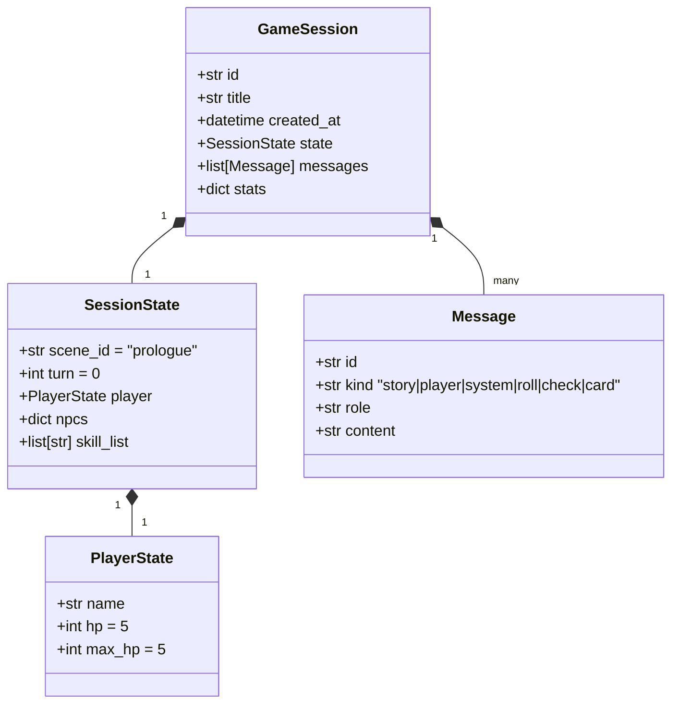
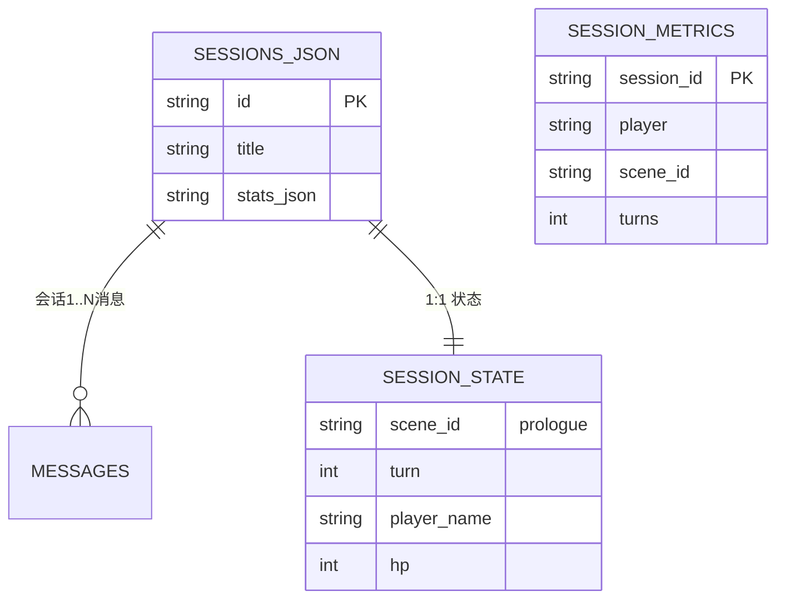
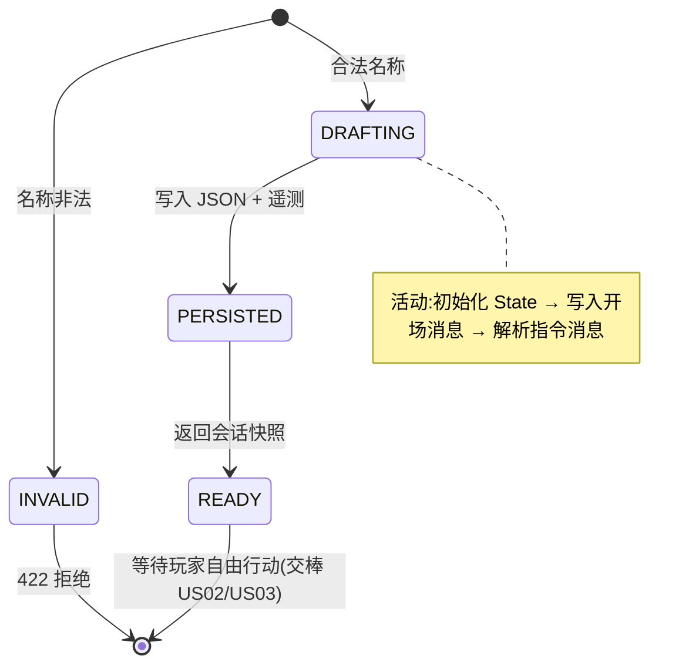

# US01 — 创建会话与开场剧情引导

> Sprint: 1   ·   Story Points: 2(M)   ·   Owner: @ai-dm-core   ·   Status: Done(CI 验证)

## INVEST 原则核对
- **I**ndependent:不依赖其他故事,可独立验收
- **N**egotiable:开场文案、默认玩家名可调整
- **V**aluable:玩家获得可恢复的跑团现场,是所有游戏行为的前提
- **E**stimable:工作量 ≤ 2SP,边界清晰
- **S**mall:仅覆盖「会话生命周期 + 开场引导」
- **T**estable:Gherkin 场景可自动执行

## 3C — Card / Conversation / Confirmation
- **Card**:作为玩家,我想要创建一个新跑团会话并获得开场剧情与操作引导,以便随时开始一局《雾中孤儿院》。
- **Conversation**:前端点击「开始新冒险」→ `POST /api/sessions`;服务端生成 `GameSession`,注入 `scene_id=prologue` 与开场消息和 `/roll`、`/check`、`/scene`、`/hp`、`/help`、`/restart` 指令说明;会话以 JSON 落盘,重启服务可恢复。
- **Confirmation**(验收标准):
  1. 返回会话快照含 `id / title / state(player, scene_id=prologue)`。
  2. 消息列表中至少包含一条开场叙述(含「铁门」「雾」)。
  3. 消息列表中至少包含一条 `system` 指令引导消息。
  4. 持久化目录生成 `data/sessions/{id}.json`,重启后可恢复。
  5. 空/超长玩家名被安全层 422 拦截。

## Gherkin (BDD)
```gherkin
# language: zh-CN
功能: 会话创建
  场景: 玩家创建会话并开始冒险
    当 我发起新会话 且玩家名为「阿梅」
    那么 会话应该以场景 "prologue" 开始
    并且 返回的问候中包含铁门与雾的叙事
    并且 会话中有一条系统指令消息
```

---

## 六图精细化建模

### 1) 故事级用例/边界图 (Story Context & Scope)


### 2) 故事级组件/数据流图 (Story Component / Data Flow Diagram)


### 3) 故事级领域类与 Pydantic 数据契约图


### 4) 故事级数据实体/持久化模型


### 5) 故事级端到端时序交互图
(同 1 图完整时序,见上 `sequenceDiagram`——本故事只与持久化/遥测交互,不触发 LLM 与外部 API,故无第三方请求。)

### 6) 故事级状态机与活动流程图


## 交付物与测试链接
- 实现:`app/gameplay.py:start_session`、`app/main.py:POST /api/sessions`、`app/persistence.py`
- 单元测试:`tests/unit/test_gameplay.py::test_start_session_seed_state`、`tests/unit/test_api.py::test_create_and_get_session`
- BDD 验收:`tests/bdd/features/core_rpg.feature`「玩家创建会话并开始冒险」
- 评测轨迹:`eval/evalset.json` tr-01