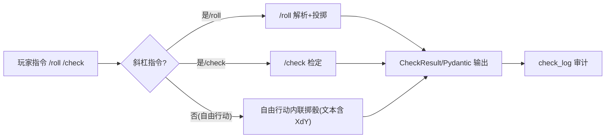
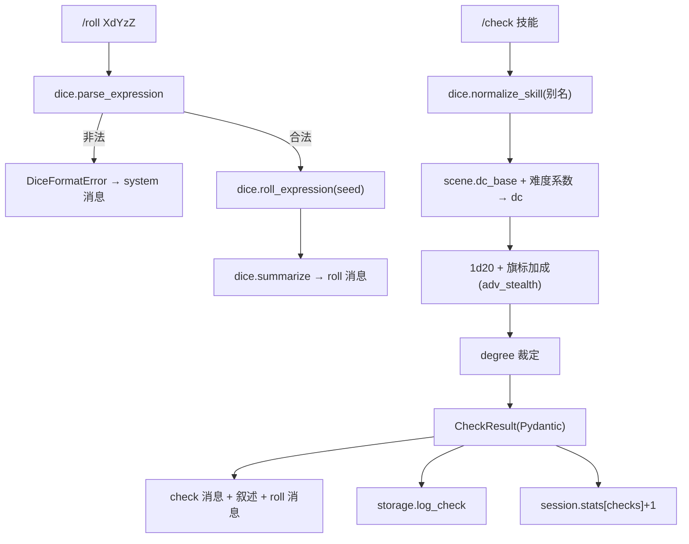
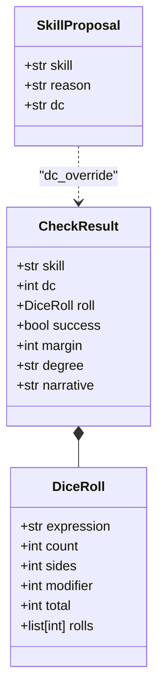
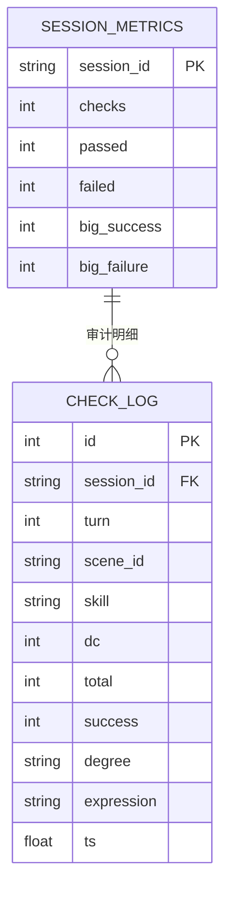
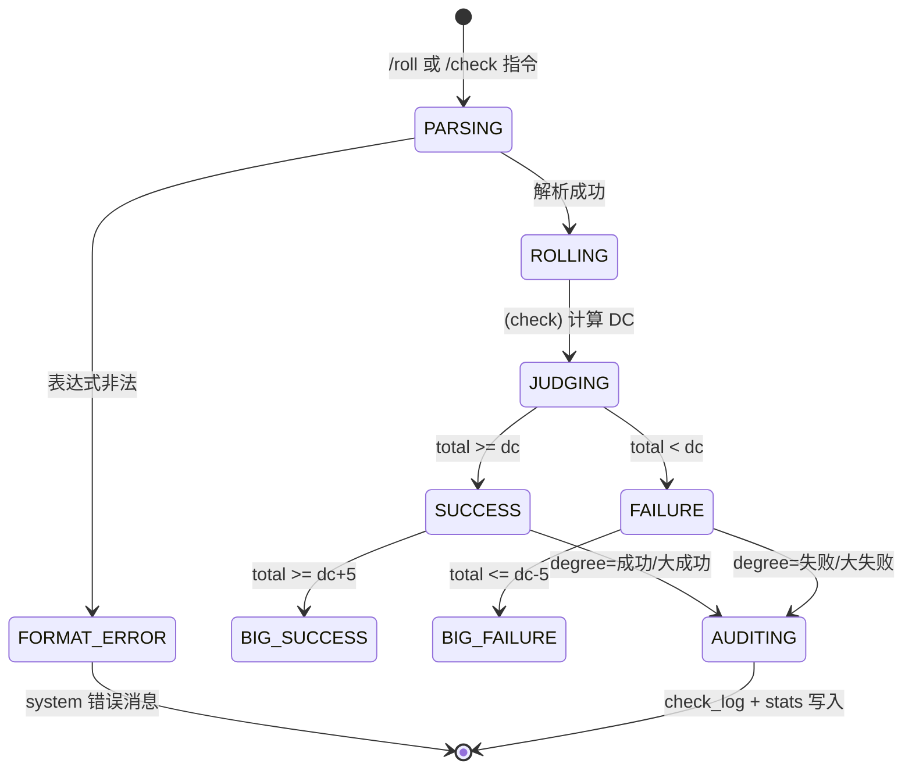

"# US03 — 骰子解析与结构化技能检定(Pydantic 数值裁决)

> Sprint: 2 · Story Points: 3(L) · Owner: @rules-engine · Status: Done(CI 验证)

## INVEST 原则核对
- **I**ndependent:不依赖 LLM,可独立测试(确定性 seed)
- **N**egotiable:DC 算法、技能别名表可调整
- **V**aluable:跑团核心——数值不确定性裁决
- **E**stimable:parser + roller + checker 三条纯函数链路
- **S**mall:只做数值裁决,不做剧情(交棒 US04)
- **T**estable:seeded 确定性,断言 total/dc/success/degree

## 3C — Card / Conversation / Confirmation
- **Card**:作为玩家,我想要掷骰并让引擎给出 DC、点数、成败与程度(大成功/成功/失败/大失败),以便数值化我的行动。
- **Conversation**:`/roll XdY±Z` 走 `dice.parse_expression` + `roll_expression`;`/check <技能>` 走 `gameplay.run_check`(按场景 `dc_base` + 技能难度系数计算 DC,潜行/闪避受 `adv_stealth` 旗标加成);每次检定写入 SQLite `check_log`(审计);LLM 结构化契约(`DMPlan.check` / `SkillProposal`)可覆写 DC。
- **Confirmation**(验收标准):
  1. `2d6+1` 正确返回 `count=2,sides=6,modifier=1,total=Σ+1`;非法表达式抛 `DiceFormatError`。
  2. `/check 侦查` 产生一条 `kind=check` 消息,meta 含 `dc/total/success/degree/skill`。
  3. `degree` 严格 ∈ {大成功,成功,失败,大失败};`success = total >= dc`。
  4. 检定后 `session.stats[checks] += 1`。
  5. `check_log` 表中新增记录(session_id, scene, skill, dc, total, success, degree)。
  6. `dc_override`(来自 `SkillProposal.dc`)生效。

## Gherkin (BDD)
```gherkin
# language: zh-CN
功能: 数值检定
  场景: 技能检定的数值裁决
    当 我在会话中发送 "/roll 2d6+1"
    那么 会话统计的掷骰次数大于等于 1
    并且 最新消息中包含骰子投掷摘要
    并且 会话统计的检定次数等于 1
    并且 最新消息包含 DC 与检定结果
```

---

## 六图精细化建模

### 1) 故事级用例/边界图


### 2) 故事级组件/数据流图


### 3) 故事级领域类与 Pydantic 数据契约图


### 4) 故事级数据实体/持久化模型


### 5) 故事级端到端时序交互图
```mermaid
sequenceDiagram
    participant F as 前端
    participant S as FastAPI /command|/chat
    participant D as dice.py
    participant G as gameplay.run_check
    participant T as storage(TelemetryStore)

    F->>S: POST /command {"/check 侦查"}
    S->>D: normalize_skill("侦查") → "侦查"
    S->>G: run_check(session, "侦查", dc_override=None)
    G->>D: roll_expression("1d20") → DiceRoll
    G->>G: dc = min(14, dc_base + bonus); success = total>=dc; degree
    G->>T: log_check(session, scene, skill, dc, total, success, degree)
    G->>G: session.stats[checks] += 1
    S->>S: 追加 check/叙述/roll 消息
    S-->>F: 200 {session, new_messages}
```

### 6) 故事级状态机与活动流程图


## 交付物与测试链接
- 实现:`app/dice.py`、`app/gameplay.py:run_check/_narrative`、`app/models.py`、`app/storage.py`
- 单元测试:`tests/unit/test_dice.py`、`tests/unit/test_gameplay.py::test_run_check_*`、`tests/unit/test_storage.py`
- BDD 验收:`core_rpg.feature`「掷骰指令」「技能检定的数值裁决」
- 评测轨迹:`eval/evalset.json` tr-02、tr-03", "filePath": "C:\\Users\\Lenovo\\Desktop\\人机协同实验\\ai-dm-engine\\docs\\user_stories\\US03_dice_check.md"}