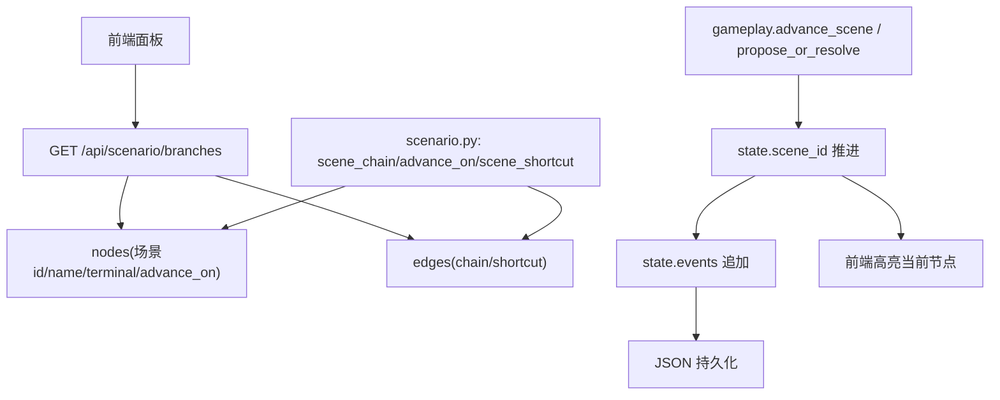
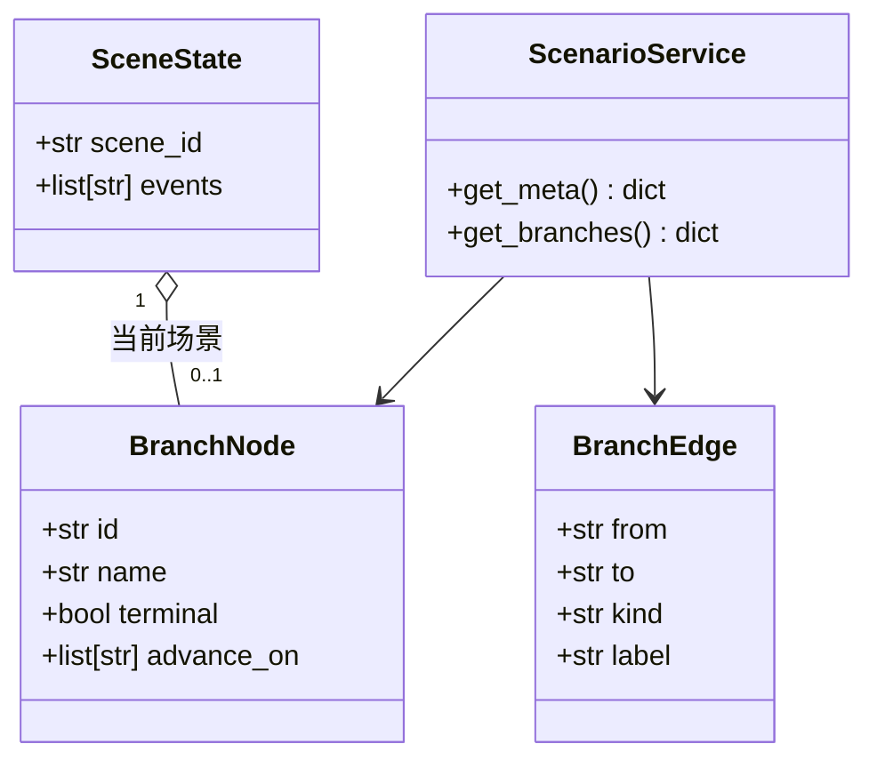
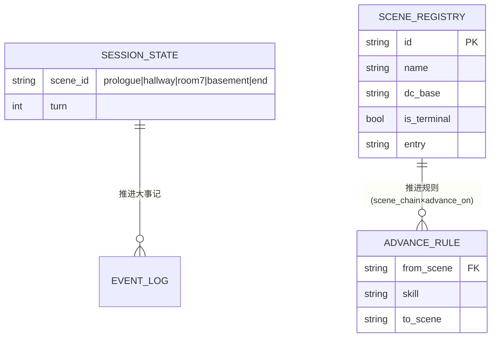
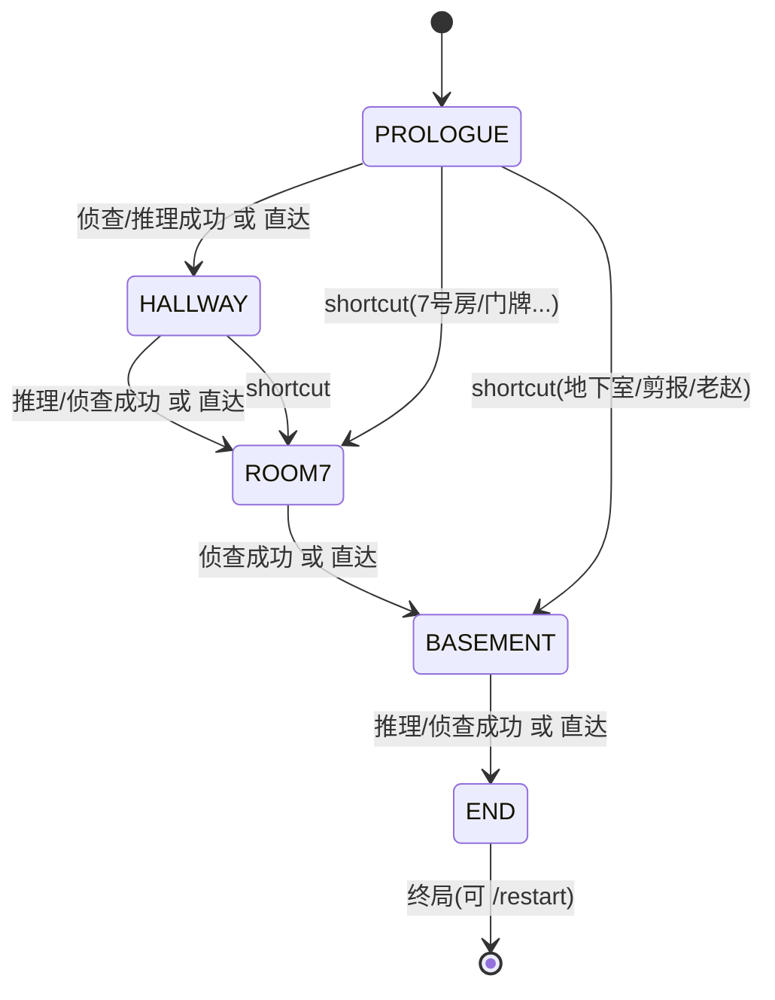

"# US04 — 剧情分支树可视化与场景推进

> Sprint: 3 · Story Points: 3(L) · Owner: @frontend @rules-engine · Status: Done(CI 验证)

## INVEST 原则核对
- **I**ndependent:依赖 US02/03 的推进结果,但自身独立可验收
- **N**egotiable:分支树展示形态(列表/图)可调整
- **V**aluable:玩家可看到剧本结构,DM 推进结果即时高亮
- **E**stimable:1 端点 + 1 前端面板
- **S**mall:仅场景链推进与可视化,不引入新机械
- **T**estable:分支树 API 字段与推进后场景断言

## 3C — Card / Conversation / Confirmation
- **Card**:作为玩家,我想要看到《雾中孤儿院》的剧情分支树并知道当前所在场景,以便理解剧情拓扑并感知推进。
- **Conversation**:`GET /api/scenario/branches` 返回 `{nodes[], edges[], order[]}`(场景链 `chain` 边 + 关键词 `shortcut` 边 + 各场景 `advance_on` 检定条件);检定成功且命中 `advance_on` 或直达词命中 `scene_shortcut` 时,`gameplay/advance_scene` 或 `propose_or_resolve` 推进 `state.scene_id` 并追加大事记;前端面板递归渲染节点并高亮当前场景。
- **Confirmation**(验收标准):
  1. `/api/scenario/branches` 返回 ≥5 节点,含 `chain` 与 `shortcut` 边。
  2. 自由行动「我推开7号房的门」(shortcut)会把场景推进到 `room7`。
  3. 场景推进后 `state.events` 追加「推进到 <场景名>」。
  4. 到达 `end`(is_terminal)后 `/restart` 可重置到 `prologue`。
  5. 前端面板高亮当前场景节点。

## Gherkin (BDD)
```gherkin
# language: zh-CN
功能: 场景推进与分支树
  场景: 自由行动触发场景推进
    当 我在会话中发送自由行动 "我推开7号房的门"
    那么 当前场景应该是 "room7"
```

---

## 六图精细化建模

### 1) 故事级用例/边界图
```mermaid
flowchart TD
    ACT["玩家行动文本"]
    SH{\"命中 scene_shortcut 直达词?\"}
    TALK{"LLM plan.advance_scene?"}
    CH{"检定成功且技能 ∈ advance_on?"}
    ADV["推进: state.scene_id = nxt + 大事记"]
    END?"is_terminal = end ... 终局"
    REST["/restart 重置 prologue"]

    ACT --> SH -- 是 --> ADV
    SH -- 否 --> TALK -- 是 --> ADV
    TALK -- 否 --> CH -- 是 --> ADV
    CH -- 否 --> STAY["留在当前场景,剧情继续"]
    ADV --> END_? -- 是 --> END_?["end 终局"]
    END_? -- /restart --> REST
    REST --> [*]
```

### 2) 故事级组件/数据流图


### 3) 故事级领域类与 Pydantic 数据契约图


### 4) 故事级数据实体/持久化模型


### 5) 故事级端到端时序交互图
```mermaid
sequenceDiagram
    participant F as 前端
    participant S as FastAPI
    participant C as gameplay/propose_or_resolve
    participant P as persistence
    participant B as branch API

    F->>S: 自由行动 "我推开7号房的门"
    S->>C: propose_or_resolve(session, text)
    C->>C: _shortcut_scene → "7号房" → plan.advance_scene
    C->>C: state.scene_id = "room7"; events += "推进到 7号房"
    S->>P: save_session(sess)
    F->>S: done 帧送达(含 session 快照)
    F->>S: GET /api/scenario/branches (或复用缓存)
    S-->>F: nodes/edges
    F->>F: 渲染树,高亮 room7
```

### 6) 故事级状态机与活动流程图


## 交付物与测试链接
- 实现:`app/main.py:/api/scenario/branches`、`app/scenario.py`(scene_chain/advance_on/scene_shortcut)、`app/gameplay.py:advance_scene`、`static/app.js:renderBranchTree`
- 单元测试:`tests/unit/test_api.py::test_scenario_branches`、`tests/unit/test_gameplay.py::test_advance_scene`
- BDD 验收:`core_rpg.feature`「自由行动触发场景推进」
- 评测轨迹:`eval/evalset.json` tr-04、tr-05